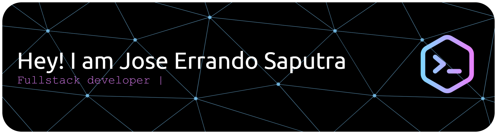

	

## About Me

- Fullstack Developer
- Interested in building web applications
- Currently improving my skills in Go
- Open to collaboration on interesting projects

## 🌐 Socials

## 💻 Tech Stack

### Languages

	
	
	
	
	
	
	

### Frameworks

	
	
	
	
	

### Infrastructure & Databases

	
	
	

## 📊 GitHub Stats

	
	

<!-- 

	

 -->

<!-- Proudly created with GPRM ( https://gprm.itsvg.in ) -->
